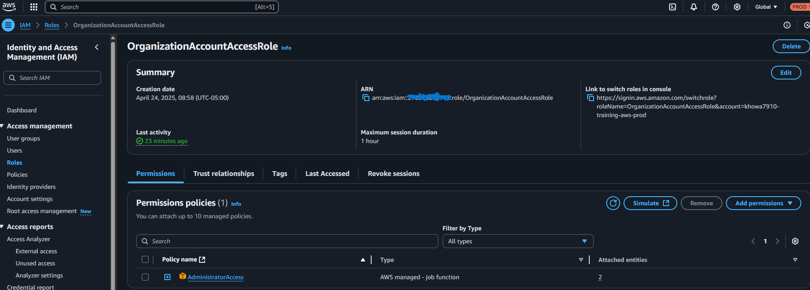
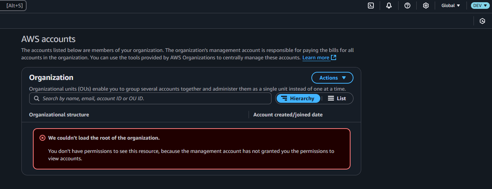
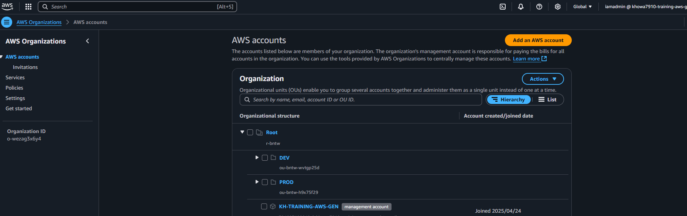

# IAM AssumeRole Setup – Console Demo

## 📂 Project Location
`console-prototypes/iam-assume-role/`

> ⛏️ This project was completed using the **AWS Console only**. Automation versions (CLI + Terraform) will be added in a later phase to demonstrate infrastructure-as-code progression.

---

## Overview  
This project demonstrates setting up AWS cross-account IAM AssumeRole access using the AWS Management Console. It enables the **`iamadmin`** user in the **Gen (management) account** to assume an Administrator-level role in both **Prod** and **Dev** accounts within the AWS Organization.

---

## Accounts & Roles

| Account Name       | Role/User Name                  | Role Permissions      | Trust Relationship                                  |
|--------------------|----------------------------------|------------------------|-----------------------------------------------------|
| Gen (Management)   | `iamadmin` user                 | IAM user with own credentials | Initiates AssumeRole calls to Prod and Dev          |
| Prod               | `OrganizationAccountAccessRole` | AdministratorAccess   | Trust policy allows `Gen` account to assume this role |
| Dev                | `OrganizationAccountAccessRole` | AdministratorAccess   | Trust policy allows `Gen` account to assume this role |

---

## Objectives  
- Enable secure, delegated administrative access from the Gen account to Prod and Dev accounts  
- Use IAM AssumeRole to switch roles and perform operations in Prod and Dev without separate long-term credentials  
- Maintain strict trust policies for controlled cross-account access  

---

## Step-by-Step Console Setup

### 1. Gen Account – IAM User `iamadmin`  
- The `iamadmin` user exists in the **Gen account**
- This user is used to authenticate and initiate AssumeRole calls to the target accounts  

### 2. Prod and Dev Accounts – Create IAM Role `OrganizationAccountAccessRole`  
- Log in to the AWS Console in Prod (and repeat for Dev)  
- Navigate to **IAM > Roles > Create Role**  
- Select **"Another AWS account"** as the trusted entity  
- Enter the **Gen account ID** as the trusted account  
- Attach the **AdministratorAccess** managed policy to the role  
- Name the role `OrganizationAccountAccessRole` (default for AWS Organizations)  
- Complete the role creation  



---

### 3. Verify Trust Policies in Prod and Dev Roles  
Ensure the trust policy allows the Gen account to assume the role:

```json
{
  "Version": "2012-10-17",
  "Statement": [
    {
      "Effect": "Allow",
      "Principal": {
        "AWS": "arn:aws:iam::GEN_ACCOUNT_ID:root"
      },
      "Action": "sts:AssumeRole"
    }
  ]
}
```

### 4. Assume Role from Gen Account
Use AWS CLI or Console to assume the role in Prod or Dev

Example CLI command:

```bash

aws sts assume-role \
  --role-arn arn:aws:iam::PROD_ACCOUNT_ID:role/OrganizationAccountAccessRole \
  --role-session-name AdminSession
```
This returns temporary credentials scoped with AdministratorAccess in the target account

## Screenshots
| Step Description      | Screenshot                                                |
| --------------------- | --------------------------------------------------------- |
| IAM Role Creation     |        |
| Dev Role Assumed      |                  |
| Prod Role Assumed     |                |
| Org Account Hierarchy |  |


## Notes
- The iamadmin user in Gen has permissions to call sts:AssumeRole on the roles in Prod and Dev
- This setup leverages AWS Organizations’ default cross-account access role for management accounts
- No custom policies or scripting were used — all actions were completed via the AWS Console
- This project will be enhanced post-SAA by scripting IAM role creation and AssumeRole via CLI or IaC tools

## References
[AWS IAM AssumeRole Documentation](https://docs.aws.amazon.com/IAM/latest/UserGuide/id_roles_use_switch-role.html)

[AWS Organizations – Cross-account Access](https://docs.aws.amazon.com/organizations/latest/userguide/orgs_manage_accounts_access.html)
